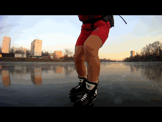

###### AI_Talalakin  

***  

### [Анатолий Игоревич Талалакин](!0SB.md#osb)   

 

*Кандидат медицинских наук, врач, колопроктолог, нутрициолог, фитотерапевт*.   

***  

**1996 г.**  - окончил **Российский Государственный Медицинский Университет** (РГМУ).

Диплом с отличием по специальности **"Лечебное дело"**.   

***  

Продолжил обучение в клинической ординатуре **Государственного Научного Центра колопроктологии МЗ РФ.**    

**1998 г.** - окончил клиническую ординатуру по специальности **Колопроктология** в ГНЦК МЗ РФ.  

В том же году был принят в клиническую аспирантуру ГНЦК МЗ РФ на базе отделения **онкопроктологии**.  

За время аспирантуры принимал участие в научных конференциях и международных конгрессах в Китае, Германии, Италии, Чехии. Проходил стажировку в онкологической клинике (г. Берлин).   

***  

**2001 г.** - окончил клиническую аспирантуру по специальности **Хирургия**, защитил кандидатскую диссертацию:

**«Брюшно-анальная резекция прямой кишки с удалением внутреннего сфинктера, формированием гладкомышечной манжетки и созданием толстокишечного резервуара в лечении рака нижнеампулярного отдела прямой кишки».**  

14.00.27. – **Хирургия**,  
14.00.14. – **Онкология**.  

***  

**2002 г.** - курс повышения квалификации по специальности **Колопроктология** (сертификат специалиста колопроктолога), продолжил работу в отделении **онкопроктологии** и консультативно-диагностическом отделении ГНЦК.  

***  

**2003 г.** - курс повышения квалификации по теме «Общая гигиена и вопросы **Рационального питания**» (ГОУВПО ММА им. Сеченова). 

***  

**2004 г.** - курс повышения квалификации по теме «**Нутрициология\Диетология**» (РУДН каф. клинической нутрициологии).  

***  

**2004 г.** - курс "**Основы метаболической терапии (глутатионы)**" Санкт-Петербург, Институт Метаболической Терапии и Иммунокоррекции.  

***  

**2006 г.** - участвовал в цикле тематического усовершенствования кафедры клинической лабораторной диагностики ФУВ ГОУ ВПО РГМУ  

"Диагностика нарушений витаминно-минерального обмена и возможности их коррекции" с отчетом: 

**"Микроэлементология в практике работы колопроктолога".**    

***  

**2006 г.** - консультативная помощь больным на базе медчасти Финансовой Академии при Правительстве РФ и медико-профилактического центра "Профи-клиник".  

***  

**2006 - 2007 г.**  
- **Врач-колопроктолог** ЦКБ РАН.  

***  

**2006 г.** - специализация по **Фитотерапии** (РМАПО).   

***  

**2007 г.** - дополнительное обучение на факультете повышения квалификации медицинских работников Российского Университета Дружбы народов по специальности:  
- "**Клиническая фитотерапия**".

Лечебно-практическая, преподавательская, информационно-образовательная деятельность.  

***  

### Автор курса: 
- «Фундаментальные основы жизнедеятельности с **Основами Системной Биорегуляции** (ОСБ)», 
- **Системы Метаболического Контроля**, 
- Пограммы «**Активного восстановления здоровья человека**».  

***  

### ОСБ. Сферы применения:   
- Воcстановление здоровья человека путем коррекции метаболического статуса   
- Повышение резерва адаптации  
- Субстратная коррекция: травы, адаптогены, аминокислоты, микроэлементы, витамины, детоксиканты   
- Восстановление желудочно-кишечного тракта, иммунной системы, биохимических процессов в головном мозге и внутренних органах   
- Устранение дисбактериоза путем создания оптимальных условий для роста аутофлоры   
- Повышение общей работоспособности человека   
- Коррекция нейро-эндокринной регуляции женского менструального цикла (болезненные, обильные месячные, ПМС, задержка и нерегулярные месячные, проблемы с зачатием ребенка)   
- Повышение половой функции у мужчин   
- Депрессии, снижение внимания и памяти, эмоциональная неустойчивость, беспричинная тревога и беспокойство, хроническая усталость, снижение толерантности к стрессовым ситуациям, нарушение сна   
- Восстановление кровоснабжения головного мозга, устранение головных болей, нейровегетативная коррекция   
- Нарушения функции щитовидной железы (гипотиреоз, тиреотоксикоз)   
- Избыточный вес и проблемы с набором веса   
- Нарушения гликемического контроля (гипогликемии, диабет II типа)   
- Субстратная поддержка при восстановлении опорно-двигательного аппарата (посттравматические состояния, остеопороз, остеохондроз, артриты, артрозы) и др.    

***  

### Информационная поддержка: 
ОСБ-лекции и семинары по тематике активного восстановления здоровья:  
- истинные причины хронических заболеваний,  
-  механизмы нарушения системной биорегуляции,   приводящие к дезадаптации и болезням,  
- способы активного самовосстановления,  
- система метаболического контроля жизнедеятельности человека.  

*** 

  
[https://t.me/osbmd](https://t.me/osbmd)  

***
