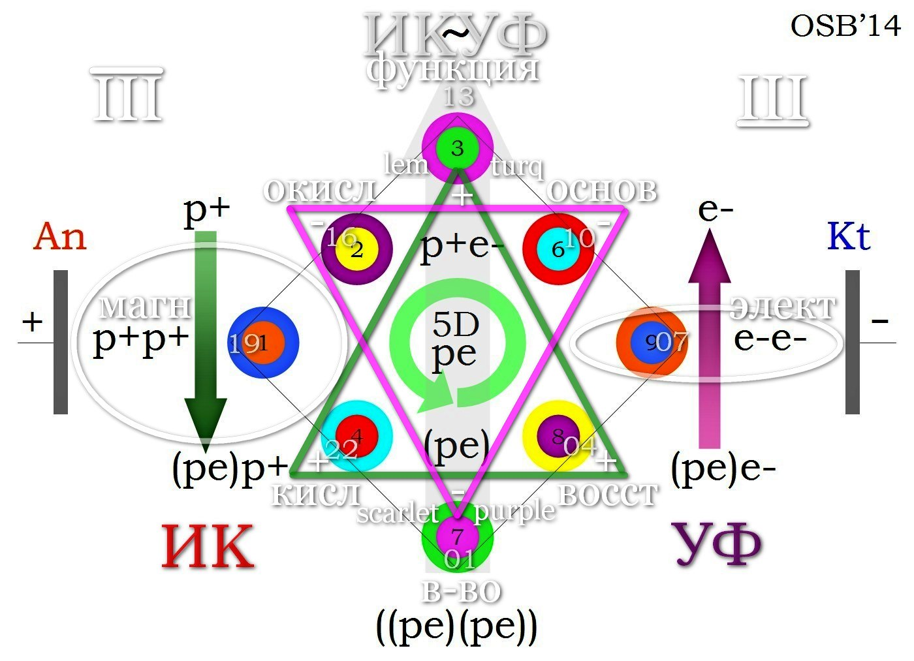

###### News   
###### [← дом](!0SB.md#osb) | [база](baza.md#baza) | [glos →](glos.md#glos) 

***   
### ОСБ. НОВОСТИ.  

***
###### 2021-11-27-11-40
#### [ОСБ / Дневник голодания]()
> 1. [День 1. Эпизод 1.](https://t.me/osbmd/3182)    
> 1. [День 1. Эпизод 2.](https://t.me/osbmd/3183)  
> 1. [День 2. Эпизод 3.](https://t.me/osbmd/3184)  
> 1. [День 3. Эпизод 4.](https://t.me/osbmd/3186) 
> 1. [День 3. Эпизод 5.](https://t.me/osbmd/3187)  
> 1. [День 3. Эпизод 6.](https://t.me/osbmd/3188)   

Продолжение следует...

> 

> 
Подробнее ↓↑
  
> Голодание как путь внутрь себя.   
> (ОСБ / Архив 2010 г.)
> 
  

***
###### 2021-11-26-08-56
#### [ОСБ / Динамика. Промеры и Состояние.]() 

Было:
  
Стало:
  

> 

> 
Подробнее ↓↑
  
> 
> Как должно измениться состояние человека, исходя из промеров в динамике?
> 
  

***
###### 2021-11-26-05-42
#### [ОСБ / Хитрый тип перекоса]()
  
  

> 

> 
Подробнее ↓↑
  
> 
> 1. Какой тип ОСБ-перекоса? 
> 1. Каким будет привычный эмоциональный фон при таких промерах? 
> 1. Какая особенность у Т-крыла данного перекоса?
> 1. Как будет меняться психическое состояние в ПМС при таком типе промеров?
> 1. Динамика веса - склонность к набору? худобе? хоббит?
> 1. Каким будет психологический эффект от еды при эмоциональной болтанке у подобного психосоматотипа? К чему может привести?
> 1. Что первично - метаболический перекос или эмоциональная раскачка по шкале состояний?
> 1. Какой эффект будут иметь физические нагрузки как нейромышечный громоотвод у данного типа? Показаны?
> 1. В каком направлении работать над собой человеку - подбирать горизонтальные метаболические бав-корректоры или выстроить вертикальное равновесие, используя широкий энергетический диапазон своего психосоматотипа?
> 1. Радоваться или переживать за человека с такими промерами? 
> 
  

***
###### 2021-11-25-07-03
#### [ОСБ / Ключ от всех дверей]()  
  
  

> 

> 
Подробнее ↓↑
  
> 
> **Что будет при таких промерах:**
> 1. с фертильностью?
> 1. с головой?
> 1. с функцией ЖКТ?
> 1. с кислотностью желудочного сока?
> 1. с pH тканей?
> 1. с забросом из тонкой кишки в желудок какого содержимого? кислого или горького щелочного? 
> 1. с кожей?
> 1. со слизистыми?
> 1. с риском носовых кровотечений?
> 1. с ногтями (ровные, неровные)?
> 1. с аппетитом? инсулином? анаболизмом? репарацией тканей? набором веса?
> 1. с действием желчегонных трав - улучшат или ухудшат состояние?
> 1. с сосочками и слизистой языка?
> 1. с болезненностью в ротовой полости при приеме раздражающих веществ - очень кислых, едких, жгучих и т. д.? (в чувствительную фазу жжения во рту каким будет крен pH слюны - в более кислую или в более щелочную сторону?)
> 1. с налетом на языке?
> 1. с отрыжкой? почему?
> 1. с зубами и кариесом?
> 1. с "искусственно вызываемой" беременностью? с эффективностью ЭКО? с вынашиванием?
> 1. с влажностью кожи?
> 1. с количеством пигмента в волосах и сроками поседения?
> 1. с ЖЕЛ?
> 1. с состоянием гайморовых пазух?
> 1. с жировой прослойкой? 
> 1. с тенденцией к набору/сгоранию веса?
> 1. с состоянием конечностей (теплые/холодные)?
> 1. с активацией щитовидки и мозгового вещества надпочечников?
> 1. с характером месячных выделений (однородные/со сгустками)?
> 1. с пульсом (тахи/бради)?
> 1. с уровнем энергии? тревожностью? беспокойством? волнением? страхом?
> 1. с сосудами головы на МРТ (нормального диаметра/сужены)?
> 1. со спазмами в животе и рвотой желчью?
> 
> **Какие меры принять?**
> 1. Что из возможных диагнозов главное и чем лечить каждое из множества проявлений? 
> 1. К скольким специалистам записаться в очередь на прием? 
> 1. Сколько всевозможных обследований надо будет у них пройти/уже пройдено? 
> 1. Будут ли эффективны терапевтические меры по каждому отдельному симптому из  текущего списка проблем?
> 1. Что первостепенно необходимо исправить в данной ситуации, чтобы вернуть тушке функционал, а женщине возможность стать счастливой мамой?
> 
  

***
###### 2021-11-23-15-16  
#### [ОСБ / Буферные растворы](https://t.me/osbmd/3176)
> 1. Что такое буферные растворы?  
> 1. Что такое лимонАТ?   
> 1. Как работает? 

> 

> 
Подробнее ↓↑
  
> 
> 1. 
> 1.  
> 1. 
> 
 

***
###### 2021-11-23-04-34
#### ОСБ / Самолечение против Жизни... 
  
> [Фрагмент эфира от 22.11.2021](https://t.me/c/1484776022/46104)

> 

> 
Подробнее ↓↑
  
> 
> ***
> ###### 2021-11-17-23-36  
> #### ОСБ / Что произошло с человеком? 
> Допустимо ли такое симптоматическое самолечение? К чему могло привести? Слава Богу обошлось...
> 
> #### [ОСБ / Ваши мысли?](https://t.me/c/1484776022/45113) 
> 
> 
> 
> 

подробнее о типе фонового перекоса:

> 
>   
> 
> - [Анализ проблемы](e20211122.md#a20211111)  
> 

> 
> ***
> ###### 2021-11-18-01-03  
> #### [ОСБ / Болтанка в зыбком пограничье...](https://t.me/c/1484776022/45120)  
> - **Криз** (вылет за край коридора) →  
> - **~~СамоЛечение~~** (вылет за другой край коридора) →  
> - **Возврат** в привычный тип удержания коридора адаптации↓
> 
> 
> 
> 

РАНЕЕ:
    

***  
###### 2021-11-22-14-34
#### ОСБ / Метаболические Шустрики и Тормоза  
<iframe width="100%" height="120" src="https://www.mixcloud.com/widget/iframe/?hide_cover=1&light=1&feed=%2FATalalakin%2F%D0%BE%D1%81%D0%B1-%D0%BC%D0%B5%D1%82%D0%B0%D0%B1%D0%BE%D0%BB%D0%B8%D1%87%D0%B5%D1%81%D0%BA%D0%B8%D0%B5-%D1%88%D1%83%D1%81%D1%82%D1%80%D0%B8%D0%BA%D0%B8-%D0%B8-%D1%82%D0%BE%D1%80%D0%BC%D0%BE%D0%B7%D0%B0%2F" frameborder="0" ></iframe> 

> 

> 
Подробнее ↓↑
  
> 
> Биоэнергетика клетки, АТФ, 2 типа энергодефицита *(полная версия 1:04:22).*   
> 

***  
###### 2021-11-22-12-52
#### А. Талалакин / Белый снег  

<iframe src="https://audiomack.com/embed/song/atalalakin/belij-sneg" scrolling="no" width="100%" height="252" scrollbars="no" frameborder="0"></iframe>

###### 2021-11-22-06-34
#### ОСБ / Невидимые причины болезней  
<iframe width="100%" height="120" src="https://www.mixcloud.com/widget/iframe/?hide_cover=1&light=1&feed=%2FATalalakin%2F%D0%BE%D1%81%D0%B1-%D0%BD%D0%B5%D0%B2%D0%B8%D0%B4%D0%B8%D0%BC%D1%8B%D0%B5-%D0%BF%D1%80%D0%B8%D1%87%D0%B8%D0%BD%D1%8B-%D0%B1%D0%BE%D0%BB%D0%B5%D0%B7%D0%BD%D0%B5%D0%B9%2F" frameborder="0" ></iframe> 

> 

> 
Подробнее ↓↑
  
> 
> *(полная версия 4:51:10).*   
> 
> [Arbalet](Arbalet.md#osb_arbalet)  
> 

***  
###### 2021-11-22-04-52
#### ON AIR / Сказки у Камина "На пороге"  

<iframe src="https://audiomack.com/embed/song/atalalakin/na-poroge" scrolling="no" width="100%" height="252" scrollbars="no" frameborder="0"></iframe>

> 

> 
Подробнее ↓↑
  
> Аудио-зарисовка с Большой Воды.  
> 
   

***  
###### 2021-11-21-20-52
#### ON AIR / Сказки у Камина (эфир)  

[OSB-21](OSB-2021.m3u8) | Радио-вещание (AIMP)  
[ON_AIR](onair.md#onair) | Записи из студии

> 

> 
Подробнее ↓↑
  
>  эфир завершен   
> 
   

***
###### 2021-11-21-11-22  
#### ОСБ / Здоровье. Уровень СБК.
<iframe width="100%" height="120" src="https://www.mixcloud.com/widget/iframe/?hide_cover=1&light=1&feed=%2FATalalakin%2F%D0%BE%D1%81%D0%B1-%D0%B7%D0%B4%D0%BE%D1%80%D0%BE%D0%B2%D1%8C%D0%B5-%D1%83%D1%80%D0%BE%D0%B2%D0%B5%D0%BD%D1%8C-%D1%81%D0%B1%D0%BA%2F" frameborder="0" ></iframe>

> 

> 
Подробнее ↓↑
  
> 
> Горизонталь соматических проявлений *(полная версия 2:56:57).*  
> 

***
###### 2021-11-21-07-34
#### ОСБ / Все намного проще  
<iframe width="100%" height="120" src="https://www.mixcloud.com/widget/iframe/?hide_cover=1&light=1&feed=%2FATalalakin%2F%D0%BE%D1%81%D0%B1-%D0%BF%D0%B5%D1%80%D0%B5%D0%BA%D0%BE%D1%81%D1%8B-%D0%BA%D0%BE%D1%80%D1%80%D0%B5%D0%BA%D1%86%D0%B8%D1%8F%2F" frameborder="0" ></iframe> 

> 

> 
Подробнее ↓↑
  
> 
> Отдельный взгляд на природу болезней человека *(полная версия 3:35:13).*  
> 

***
###### 2021-11-21-07-04
#### ОСБ / Гипотиреоз. АИТ.  
<iframe width="100%" height="120" src="https://www.mixcloud.com/widget/iframe/?hide_cover=1&light=1&feed=%2FATalalakin%2F%D0%BE%D1%81%D0%B1-%D0%B3%D0%B8%D0%BF%D0%BE%D1%82%D0%B8%D1%80%D0%B5%D0%BE%D0%B7-%D0%B0%D0%B8%D1%82%2F" frameborder="0" ></iframe>

> 

> 
Подробнее ↓↑
  
> 
> Щитовидная железа и проявления системного перекоса *(4:21:09).*  
> 

***
###### 2021-11-21-05-04
#### ОСБ / Тирозиновая коробка передач  
<iframe width="100%" height="120" src="https://www.mixcloud.com/widget/iframe/?hide_cover=1&light=1&feed=%2FATalalakin%2F%D0%BE%D1%81%D0%B1-%D1%81%D1%82%D1%80%D0%B5%D1%81%D1%81-%D1%82%D0%B8%D1%80%D0%BE%D0%B7%D0%B8%D0%BD%D0%BE%D0%B2%D0%B0%D1%8F-%D0%BA%D0%BE%D1%80%D0%BE%D0%B1%D0%BA%D0%B0-%D0%BF%D0%B5%D1%80%D0%B5%D0%B4%D0%B0%D1%87%2F" frameborder="0" ></iframe>

> 

> 
Подробнее ↓↑
  
> 
> Стресс или реакция активации  *(2:12:45).*  
> 
> 
> 
> 

***
###### 2021-11-21-04-44
#### ОСБ / По образу и подобию
<iframe width="100%" height="120" src="https://www.mixcloud.com/widget/iframe/?hide_cover=1&light=1&feed=%2FATalalakin%2F%D0%BE%D1%81%D0%B1-%D0%BF%D0%BE-%D0%BE%D0%B1%D1%80%D0%B0%D0%B7%D1%83-%D0%B8-%D0%BF%D0%BE%D0%B4%D0%BE%D0%B1%D0%B8%D1%8E-%D1%81%D0%B5%D1%80%D0%B4%D1%86%D0%B0-%D0%B0%D1%83%D0%B4%D0%B8%D0%BE-%D0%B2%D1%81%D0%B5-%D1%87%D0%B0%D1%81%D1%82%D0%B8%2F" frameborder="0" ></iframe>

> 

> 
Подробнее ↓↑
  
> 
> Сердце как эталон рабочего мышечного органа в режиме non stop *(полная версия 3:42:32).*  
> 
   

***
###### 2021-11-20-20-44
#### ОСБ / Зелёный коридор возможностей
<iframe width="100%" height="120" src="https://www.mixcloud.com/widget/iframe/?hide_cover=1&light=1&feed=%2FATalalakin%2F%D0%BE%D1%81%D0%B1-%D0%B7%D0%B5%D0%BB%D0%B5%D0%BD%D1%8B%D0%B9-%D0%BA%D0%BE%D1%80%D0%B8%D0%B4%D0%BE%D1%80-%D0%B2%D0%BE%D0%B7%D0%BC%D0%BE%D0%B6%D0%BD%D0%BE%D1%81%D1%82%D0%B5%D0%B9%2F" frameborder="0" ></iframe>

> 

> 
Подробнее ↓↑
  
> 
> Система активного восстановления здоровья ОСБ *(полная версия 3:17:53).*  
> 
   

***
###### 2021-11-20-05-19  
#### ОСБ / Энергия, движение, здоровье  

<!-- blank line -->
<figure class="video_container">
<iframe width="100%" height="100%" src="https://www.youtube.com/embed/Y9kZ3HNXxWo" frameborder="0" allowfullscreen="true"> </iframe>
</figure>

<!-- blank line -->   
> 

> 
Подробнее ↓↑
  
> 
> Ключевые аспекты системы активного восстановления здоровья на базе принципов ОСБ *(полная версия 4:13:20).*  
> 
  

***
###### 2021-11-19-08-48  
#### ОСБ / Основы субстратной коррекции Ш и Т
<figure class="video_container">
<iframe src="https://www.youtube.com/embed/X6ElFHad7i0" frameborder="0" width="100%" height="100%" allowfullscreen="true"> </iframe>
</figure>
<!-- blank line -->   

> 

> 
Трофология острого и хрон. стресса ↓↑
  
> 
> 
> 
 

###### 2021-11-19-07-49  

#### ОСБ / Динамика вчерашней истории с кризом.

> 

> 
 Почасовой экспресс-отчет ↓↑ 
  
> 
> 
> 

***
###### 2021-11-19-06-01
#### ON AIR / Шекспир. 8 Сонетов.
<iframe src="https://audiomack.com/embed/song/atalalakin/8sonetov" scrolling="no" width="100%" height="252" scrollbars="no" frameborder="0"></iframe>

***
###### 2021-11-18-23-31
#### ОСБ / ПУТЕВОДИТЕЛЬ
<iframe width="100%" height="120" src="https://www.mixcloud.com/widget/iframe/?hide_cover=1&light=1&feed=%2FATalalakin%2F%D0%BE%D1%81%D0%B1-%D0%BF%D1%83%D1%82%D0%B5%D0%B2%D0%BE%D0%B4%D0%B8%D1%82%D0%B5%D0%BB%D1%8C%2F" frameborder="0" ></iframe>  

***
###### 2021-11-18-23-13  
#### ОСБ / Аксиомы
<iframe width="100%" height="120" src="https://www.mixcloud.com/widget/iframe/?hide_cover=1&light=1&feed=%2FATalalakin%2F%D0%BE%D1%81%D0%B1-%D0%B0%D0%BA%D1%81%D0%B8%D0%BE%D0%BC%D1%8B%2F" frameborder="0" ></iframe>  

***
###### 2021-11-18-23-03
#### ОСБ / А в Москве выпал снег...  
<iframe src="https://audiomack.com/embed/song/atalalakin/snow0" scrolling="no" width="100%" height="252" scrollbars="no" frameborder="0"></iframe>

***
###### 2021-11-18-16-06
#### ОСБ / Аммиачная интоксикация  
<!-- blank line -->
<figure class="video_container">
<iframe src="https://www.youtube.com/embed/xwOsi00kJkU" frameborder="0" width="100%" height="100%" allowfullscreen="true"> </iframe>
</figure>
<!-- blank line -->   

***
###### 2021-11-18-12-17  
### Азот и его производные   

Хорошо или плохо есть или не есть мясо? Вот мы вегетарианцы, не едим, и нам хорошо! А когда едим, чувствуем себя плохо... Почему?  

Не потому, что вегетарианство это какая-то панацея, а потому что человек перестает употреблять весьма не простую субстанцию.  

Что такое мясо? Это не только белок! Это клетки мышечной ткани, содержащие белок  
- плюс ядра клеток с ДНК и РНК  
- плюс АТФ, АДФ, АМФ, ГМФ и др. . . 

подробнее↓
  

>
> Всё это **азотистые основания** (!), и если в аминокислотах содержится, как правило, по одной аминогруппе, то в **пуринах** и **пиримидинах** их несколько (особенно в пуринах).  
> 
> Из аминокислот только **глутамин** содержит две аминогруппы. Это самая мощная по донорству азота аминокислота, необходимая для белкового синтеза и восстановления слизистых оболочек у прогорающих шустриков, крайне важная для **репарации** тканей после травм и реабилитации оперированных пациентов.  
> 
> Если в этот момент не дать глутамин и аминокислоты извне - организму придется извлекать источники белка для восстановления поврежденных структур из собственных тканей, выключенных из активного функционирования, например, из мышц. Как следствие - мышечная дистрофия иммобилизированной конечности.  

***
#### Необходим полный набор аминокислот! 

> Почему именно **аминокислоты**? Потому что организм в состоянии интоксикации, стресса, кризисного энергообмена просто не в праве тратить собственные!  
> 
> Почему не **белки**? Потому что в условиях энергодефицита и симпатического стресса собственное пищеварение задавлено. Процесс синтеза из аминокислот пищеварительных ферментов, необходимых для переваривания белков, **энергозатратен**, да и не до того, когда выживать надо. Весь **пул доступных аминокислот** направляется под задачи работы мозга, иммунной системы, процессов репарации.  
> 
> А что с мясом? На переваривание мяса организму авансом нужно потратить около **30% энергии**, чтобы разобрать пищевой белок до аминокислот, а потом из аминокислот синтезировать собственные специфические белки, иммуноглобулины, нейромедиаторы, энзимы и другие БАВ.  
> 
> Поэтому даём **лёгкий корм с минимальным СДД** (специфическим динамическим действием пищи), который легко всасывается и быстро идёт на восполнение **пула аминокислот**, необходимого для решения задач репаративного анаболизма ("**латки дыр**"):  
> 
> - полный набор жидких аминокислот  
> - BCAA 2:1:1  
> - глутамин  
> - яйца всмятку  
> - икра  
> - проростки-наклевыши  

А. И. Талалакин  

(продолжение следует...)

***
###### 2021-11-18-01-03  
#### [ОСБ / Болтанка в зыбком пограничье...](https://t.me/c/1484776022/45120)  
- **Криз** (вылет за край коридора) →  
- **~~Лечение~~** (вылет за другой край коридора) →  
- **Возврат** в привычный тип удержания коридора адаптации↓

***
###### 2021-11-17-23-36  
#### ОСБ / Что произошло с человеком? 
> Допустимо ли такое симптоматическое самолечение? К чему могло привести? Слава Богу обошлось... Завтра пришлют точные цифры сегодняшней ситуации с динамикой промеров и отчётом.

#### [ОСБ / Ваши мысли?](https://t.me/c/1484776022/45113) 

подробнее о типе фонового перекоса:

  

- [Анализ проблемы](e20211122.md#a20211111)  

***
###### 2021-11-17-03-23   
#### ОСБ / Динамика Май → Октябрь 2021 г. 
#### [Как оценить динамику? + или -?](https://t.me/c/1484776022/44787)  
Май
 
Ноябрь
  
Май
  
Октябрь

***
###### 2021-11-17-00-12  
#### [ОСБ / Что можете рассказать о СБК?](https://t.me/c/1484776022/44785)

***
###### 2021-11-16-19-18
#### [ОСБ / Почему симптоматические меры не работают в данном примере?](https://t.me/c/1484776022/44671)  
  
- [Анализ проблемы](e20211122.md#a20211111)  

***
###### 2021-11-16-16-56  
#### ОСБ / Интересно, откуда приток сегодня?

***
#### 2021-11-14   
#### [Внимание! Отчётные формы обновлены!](!0SB_Instructio.md#0sb_instructio)  
Теперь все должно работать из любого офисного аналога Excel. Надеюсь, что даже с [айфонов и маков](https://t.me/osbmd/3142) проблем с заполнением промеров не будет.  Благодарю Вас за обратную связь.   

Старые формы больше не принимаются! 

  

***
###### 2021-11-14-14-09
#### ОСБ / Гипервентиляция и гипоксия. Парадокс?
#### [Скоро...]()
 

***
###### 2021-11-13-22-28
#### [ОСБ / Тип перекоса?](https://t.me/c/1484776022/43983)   

- [Анализ проблемы](a20211107.md#a20211107)  

***
###### 2021-11-13-20-13
#### ОСБ / Про дистиллят и мозг  

[Преамбула](https://t.me/c/1484776022/43537)

> 1. [Про дистиллят ч. 1.](https://t.me/c/1484776022/43829)
> 1. [Про дистиллят ч. 2.](https://t.me/c/1484776022/43844)
> 1. [Про дистиллят ч. 3.](https://t.me/c/1484776022/43849)

***
###### 2021-11-12-12-53
#### ОСБ / Динамика:  Март → Ноябрь

Март

подробнее:

***
Май

***
Июнь

***
Июль

***
Сентябрь

***
Ноябрь

***
###### 2021-11-11-23-26
#### [Кухня ОСБ / Про шпатели](https://t.me/osbmd/3137)  

***
###### 2021-11-11-22-22  
#### [ОСБ / Про ЭГ и местное воспаление](https://t.me/c/1484776022/43222)  
  

***
###### 2021-11-11-22-11 
#### [ОСБ / Про уши](https://t.me/c/1484776022/43213) 
   

***
###### 2021-11-11-00-00 
#### [Стихи](poet.md#poet)  
 

***  
###### 2021-11-08-22-20  
#### [ОСБ / Глоссарий](glos.md#glos) 

***
###### 2021-11-08-21-29
#### ОСБ / Кислоты и Основания
  

***
###### 2021-11-07-20-57
#### [ОСБ / Про ПНЖК и Ш](https://t.me/osbmd/3110)  

***  
###### 2021-11-07-20-34  
#### [ОСБ / Про клетчатки](https://t.me/osbmd/3109)  

***
###### 2021-11-07-19-21
###### ОСБ / СИСТЕМА МЕТАБОЛИЧЕСКОГО КОНТРОЛЯ
 
> Целью системы мультифакторного метаболического контроля (USF-версия) является выявление индивидуальных фазовых отклонений в течении основных гомеостатических процессов в организме человека. 

> Гомеостаз - понятие, отражающее способность организма поддерживать значения основных констант жизнедеятельности (T, pH, электропроводности, уровня электролитов в сосудистом русле и тканях, гидратации, гликемии, пула свободных аминокислот, соотношения основных групп липидов - стеринов и жирных кислот и др.) в пределах «зеленого коридора» нормы. 

> При сбалансированных обменных процессах (метаболизме) суточные колебания основных констант жизнедеятельности не выходят за рамки «зеленого коридора», что обеспечивает максимальный КПД функционирования организма. 

> Любое своевременно не скорректированное «отклонение вверх» или «отклонение вниз» за пределы коридора нормы приводит к изменению точки равновесия обратимых биохимических реакций и, как следствие, к стойкому изменению констант жизнедеятельности, что проявляется сначала неспецифично - снижением общего уровня энергии (КПД), изменениями со стороны психики - от подавленности, депрессии, сонливости и хронической усталости до раздражительности, агрессии, бессоницы и состояния «взведенной пружины»; затем развиваются вполне определенные функциональные нарушения в тех или иных органах и системах организма, и в завершении всего запущенные дисбалансы выходят на соматический уровень в виде конкретных симптомов и болезней. 

> Попытка устранить симптом «лекарством от...» приносит лишь временное облегчение состояния, но не устраняет, а наоборот затягивает прогрессирование существующего метаболического дисбаланса. 

> Перед нами стоит простая и конкретная задача - максимально быстро выявить перекосы в фундаментальных секторах жизнеобеспечения: 

Продолжение следует...  

***  
###### 2021-11-07-05-04
#### [ОСБ / Про нагрузки ](News.md#2021-10-31-05-05)

***
###### 2021-11-06-13-39  
#### ОСБ / Уровни организации МЭ по E. Revici
> 

> 

***
###### 2021-11-06-12-28
#### [ОСБ / Благодарность](https://t.me/c/1484776022/41636)  

***
###### 2021-11-05-21-25  
#### [10 лет с ОСБ / эфир](e20211028.md#e20211028)  
>    
[Фрагмент эфира](https://t.me/osbmd/3128)  

***
###### 2021-11-05-16-21
#### Вопрос:
>В каком направлении текут "метаболические токи"?

#### А. И. Талалакин:
>Токи текут на повышение ОВП. От минус ОВП к плюс ОВП.

>Задаёт направление токам субстанция с максимальным ОВП. В случае с СБК в норме это кислород.

###### [ОСБ / FAQ](faq.md#2021-11-05-16-21)  

***
###### 2021-11-05-08-15
#### Вопрос:  
>Как определить тип метаболического дисбаланса при измерении ПН мочи?

#### А. И. Талалакин:
>5D - ПН=68-69 дин/см  
>3D - ПН<68 дин/см  
>7D - ПН>69 дин/см  

***
###### 2021-11-05-07-59
#### Вопрос:
>Каков тканевой механизм понижения ПН в интерстициальном секторе у Ш?  

#### А. И. Талалакин:
>Следствие "омыления". ПАВы как продукт развала мембран понижают поверхностное натяжение интерстициальной жидкости, что приводит к ещё большему ускорению катаболических реакций. 

>Измерив ПН мочи [уротензиометром](https://t.me/osbmd/140), можно без долгих обследований и анализов сделать вывод о характере текущего метаболического перекоса. 

***
###### 2021-11-05-04-43  
#### Вопрос:
>Какой параметр водопроводной воды опасен для здоровья? Какой перекос усугубляется при ее использовании внутрь?

#### А. И. Талалакин:
>Высокий окислительно-восстановительный потенциал:  ОВП (+200 +400 мВ и более). Вода из-под крана - окислитель. Ткани Ш и так переокислены - дополнительное введение окислителя усугубит тканевое повреждение.   

>Для Т с перевосстановленным месивом в кишке - клизмы с такой водой, наоборот, окажут лечебный контрдисбалансный эффект.

***  
###### 2021-11-04-21-39  
#### [ОСБ / Про воду из крана](https://t.me/osbmd/3090)   

  
Фильтр на трековой мембране и водопроводная вода.  1 неделя использования.    
- [Другие фрагменты эфира](News.md#2021-10-31-05-05)  

***  
###### 2021-11-04-10-16  
#### ОСБ / Энергообмен  у ребенка и взрослого:

**Анаэробный гликолиз**   
\+ несократительный термогенез в бурой жировой ткани    
↓  
**Аэробное окисление субстратов**    
\+ сократительный мышечный термогенез  

подробнее:

> "В течение 1-го года жизни ребенка существенно меняется обмен, характерный для эмбрионального периода существования. Важной возрастной особенностью энергетического обмена является адаптация новорожденного ребенка к легочному типу снабжения организма кислородом. В процессе внутриутробного развития плод находится в условиях относительной гипоксии - у него более интенсивно протекают процессы анаэробного окисления углеводов. После рождения ребенка и становления легочного типа снабжения кислородом анаэробные процессы окисления сменяются аэробными: начинают активнее протекать реакции окисления с участием кислорода и окислительного фосфорилирования.
> 
> Большое значение имеет возрастное развитие механизмов терморегуляции. По мере роста ребенка и увеличения его массы тела вклад химической терморегуляции снижается. 
> 
> У новорожденных детей имеются специфические, отсутствующие у взрослых механизмы термогенеза. Если у взрослого в ответ на охлаждение включается «сократительный» термогенез - холодовая дрожь, то у ребенка активируется «несократительный» термогенез. До 1 года он связан с функционированием бурой жировой ткани. Особенности ее метаболизма определяет высокое содержание митохондрий и ферментов дыхательной цепи - цитохромов, наряду с относительно низкой активностью АТФ-синтазы. В митохондриях клеток этой ткани окисление и фосфорилирование не являются сопряженными процессами. Протонный градиент, существующий в норме на внутренней мембране митохондрий, в бурой жировой ткани рассеивается. Функцию разобщителя окисления и фосфорилирования выполняет термогенин - белок, осуществляющий обратный перенос протонов из межмембранного пространства в матрикс митохондрий. Вследствие этого процесса свободная энергия переноса электронов используется не для синтеза АТФ, а для поддержания температуры тела на постоянном уровне. Бурый жир у ребенка расположен в области шеи и межлопаточной области. 
> 
> В течение первого года жизни активность химической терморегуляции снижается, начиная с 5-6 месяцев возрастает роль «сократительной» терморегуляции. У ребенка старше 3 лет главенствующую роль в повышении теплопродукции начинает играть сократительная активность скелетных мышц: мышечный тонус и мышечная дрожь."

***  
PS: [45 минут активного термогенеза при T = -16С](https://t.me/osbmd/2489)  

***  
###### 2021-11-04-06-51 
#### [ОСБ / Про овощи, "мыла" и катионы](https://t.me/osbmd/3088)  
- [Про соду, цитрат и pH](https://t.me/osbmd/2492)   

  
  
- [Фрагменты эфира](News.md#2021-10-31-05-05)
- [Гниение белков в ЖКТ](Mtb_B.md#mtb_b)

подробнее:

> рН кала зависит от жизнедеятельности микрофлоры кишечника и рациона животного. В норме у плотоядных животных  реакция кала слабокислая или нейтральная (рН 5,5-7,0).  При  усилении  процессов бактериального разложения белков (гниения) усиливается образование аммика и рН каловых масс смещается  в щелочную реакцию. При усилении брожения выделяется СО2 и органические кислоты при этом рН сдвигается в кислую сторону.  При различных воспалительных процессах и нарушении ферментативной деятельности поджелудочной железы или тонкого кишечника развивается гнилостная микрофлора кишечника, что также ведет к защелачиванию кала. Усиление перистальтики и употребление некоторого рода растительной клетчатки способствует развитию бродильной микрофлоры и кислой реакции.   

> https://mitrokhina.ru/osnovnye-analizy/koprogramma.html

> Реакция (рН) отражает кислотно-щелочные свойства стула. В норме реакция является нейтральной или слабощелочной (6,8-7,5). Кислая или щелочная реакция в кале обусловлена активизацией деятельности тех или других типов бактерий, что происходит при нарушении ферментации пищи. Кислая реакция (pH 5,5–6,7) отмечается при нарушении всасывания в тонкой кишке жирных кислот; резко-кислая реакция (pH менее 5,5) имеет место при бродильной диспепсии, при которой в результате активации бродильной флоры (нормальной и патологической) образуются углекислый газ и органические кислоты. Щелочная реакция (pH 8,0–8,5) наблюдается при гниении белков пищи (не переваренных в желудке и тонкой кишке) и воспалительном экссудате в результате активации гнилостной флоры и образовании аммиака и других щелочных компонентов в толстой кишке, резкощелочная реакция (pH более 8,5) – при гнилостной диспепсии (колите).   

> https://labmd.ru/sections/zabolevaniya-kishechnika-i-pecheni/markery-porazheniya-zheludochno-kishechnogo-trakta

***  
###### 2021-11-03-09-33  
#### ОСБ / Арбалет-pe  
  

***  
###### 2021-11-03-00-45   
#### ОСБ / pe-EM_Матрица:   

|:---: |:---:| :---:|  
p+p+| p+ | **~**   
p+(pe) | **p+e-**   | e-   
**(pe)(pe)** | (pe)e- | e-e-    

#### На осях pH (0X) и ORP (0Y):  
3D  и 7D  за пределами добра и зла.  
Они уже вне диапазона кислотно-основных и окислительно-восстановительных игр: 
- 3D - это пшик, излучение, тепло, энергия
- 7D  - неионизированная материя вне обмена веществ и электро-магнитных флуктуаций, энергия, замороженная в вещество, структуру.

 

  
  

***  
###### 2021-11-02-17-38  
#### ОСБ / Матрица Квадрантов:   
(совмещение с промерами)   

|:---: |:---:| :---:|  
1D | 2D | **3D**   
4D | **5D**   | 6D   
**7D** | 8D | 9D   

   
  

***  
###### 2021-11-01-22-22  
#### [ОСБ-22](!0SB.md#!0sb)  
1.11.2021 г. До НГ ждать не будем.  

Всех сопричастных поздравляю с досрочным переходом на мобильный формат (без VPN).   

Спасибо, что все эти годы вы были с нами.  

**Движемся дальше!**

  

***   
###### 2021-11-01-15-00  
#### [ОСБ / Инструкции. Обновление от 1.11.2021 г.](!0SB_Instructio.md#0sb_instructio)  
   

***  
###### 2021-11-01-03-00   
#### ОСБ / Нейросеть 
(фрагмент брейншторма от 31.10.2021 г).  

  

| | | |
|:-|:-|:-|
| Вит Е | ДМСО | Клизмы |
| Глицерин |  АЦЦ |  Энтеросгель |
| Глутамин | Лизин | Тиосульфат |
| Сливочное масло | АК | Se |
| Сало | BCAA | Вит. С |
| Кокос. масло | АСД-2| Льняное масло |
| C2H5OH + Ж | Галавит| S |
| Хлорофилл | Пыльца | MgSO4 |
| DMG | Мумие | Чеснок |
| Нормотим | Подмор| Лук |
| Зюзник | Перга | Хрен |
| Хвощ | Прополис | Капуста |
| Регидрон | Эф. масла | Горчица |
| Желтушник | МСМ ХС ГА | Тирозин |
| ВАЛ | Донник | Фенилаланин |
| Саликс | Деготь| Сода |
| Солодка | Скипидар | KMnO4 |
| ЛимонАТ | Живица | H2O2 |

***   
###### 2021-10-31-05-05    
#### [ОСБ / Анализ проблемы](a20211025.md#a20211025)  
#### [Динамика не-достижений 2013 → 2021 г.](d20211025.md#d20211025)  

  
- [Фрагмент эфира №1](https://t.me/osbmd/3087) Диагнозы или перекос?
- [Фрагмент эфира №2](https://t.me/osbmd/3088) Про овощи, "мыла" и катионы.
- [Фрагмент эфира №3](https://t.me/osbmd/3090)  Про воду из крана.
- [Фрагмент эфира №4](https://t.me/osbmd/3091)  Про кисломолочку.
- [Фрагмент эфира №5](https://t.me/osbmd/3098)  Про нагрузки.
- [Фрагмент эфира №6](https://t.me/osbmd/3109)  Про клетчатки.
- [Фрагмент эфира №7](https://t.me/osbmd/3110)  Про ПНЖК и Ш.  
- [Фрагмент эфира №8](https://t.me/osbmd/3111)  Заключение.
- [Гниение белков в ЖКТ](Mtb_B.md#mtb_b) 

подробнее:

> рН кала зависит от жизнедеятельности микрофлоры кишечника и рациона животного. В норме у плотоядных животных  реакция кала слабокислая или нейтральная (рН 5,5-7,0).  При  усилении  процессов бактериального разложения белков (гниения) усиливается образование аммика и рН каловых масс смещается  в щелочную реакцию. При усилении брожения выделяется СО2 и органические кислоты при этом рН сдвигается в кислую сторону.  При различных воспалительных процессах и нарушении ферментативной деятельности поджелудочной железы или тонкого кишечника развивается гнилостная микрофлора кишечника, что также ведет к защелачиванию кала. Усиление перистальтики и употребление некоторого рода растительной клетчатки способствует развитию бродильной микрофлоры и кислой реакции.   

> https://mitrokhina.ru/osnovnye-analizy/koprogramma.html

> Реакция (рН) отражает кислотно-щелочные свойства стула. В норме реакция является нейтральной или слабощелочной (6,8-7,5). Кислая или щелочная реакция в кале обусловлена активизацией деятельности тех или других типов бактерий, что происходит при нарушении ферментации пищи. Кислая реакция (pH 5,5–6,7) отмечается при нарушении всасывания в тонкой кишке жирных кислот; резко-кислая реакция (pH менее 5,5) имеет место при бродильной диспепсии, при которой в результате активации бродильной флоры (нормальной и патологической) образуются углекислый газ и органические кислоты. Щелочная реакция (pH 8,0–8,5) наблюдается при гниении белков пищи (не переваренных в желудке и тонкой кишке) и воспалительном экссудате в результате активации гнилостной флоры и образовании аммиака и других щелочных компонентов в толстой кишке, резкощелочная реакция (pH более 8,5) – при гнилостной диспепсии (колите).   

> https://labmd.ru/sections/zabolevaniya-kishechnika-i-pecheni/markery-porazheniya-zheludochno-kishechnogo-trakta

***  
###### 2021-10-31-01-06   
#### [ОСБ / Путеводитель](https://youtube.com/playlist?list=PLZfvuj_2FzFo3Ng8QJ78yQP2Vr1lOE5Eq)  
   

***  
###### 2021-10-30-20-36  
#### [Spirit v.1 (Win XP)](https://drive.google.com/file/d/1HuOIZ22ML-eodVA-BY9v9bYibT9UU4PK/view?usp=sharing)  
#### [О задержках дыхания](https://t.me/c/1484776022/39745)   

  

***  
###### 2021-10-30-20-02   
#### ДНК-20211030
- [Векторный рисунок бытия](https://t.me/c/1484776022/39740)   
- [Бессистемно-потоковая нейросеть](https://t.me/c/1484776022/39751)  
- [Про термогенез на 1К и 2К](https://t.me/c/1484776022/39831)   

  

***  
###### 2021-10-30-01-20  
#### [ОСБ / Терморегуляция](https://youtu.be/9erfGAk3-qw)  
  

***  
###### 2021-10-29-22-25   
#### [Термостат СБК](https://t.me/osbmd/3079)
  

***  
###### 2021-10-29-21-02  
#### [ОСБ / Опыт холодовой реабилитации](https://www.youtube.com/watch?v=WG7XFWfhi3I)

#### [Про тепловое ядро и оболочку](lib-zolotarev-holod.md#yadro)  
#### [Холодовые практики](https://www.youtube.com/playlist?list=PLABB8758704860C4F) 

***  
###### 2021-10-29-16-56  
#### [Синусоида терморегуляции](https://t.me/osbmd/3076).
   
- [Влияние холода на организм](lib-zolotarev-holod.md#lib-zolotarev-holod)  
- [Про тепловое ядро и оболочку](lib-zolotarev-holod.md#yadro)  

***  
###### 2021-10-29-18-19  
#### [Про Лапина и тормозов](https://t.me/c/1484776022/39487)
  
#### [Аудио-рассказ](https://t.me/c/1484776022/39515)  

  

***  
###### 2021-10-29-01-37  
#### [ОТЗЫВЫ.](otziv.md#otziv)  Дополнил сайт ещё одной рубрикой.

  

[https://t.me/osb_otziv](https://t.me/osb_otziv)

***  
###### 2021-10-28-18-05  
#### [Про ОСБ и смартфоны (аудио-включение).](https://t.me/c/1484776022/39339)  
  

***
#### 2021-10-28
#### [ОСБ / Динамика "Было→Стало".](e20211028.md#e20211028)  
   

***  
###### 2021-10-28-02-29  
#### ЭО МЭ  
  

***  
###### 2021-10-28-02-09    
#### ПНЖК. Куда ушел весь Йод и Хлор?  
  

***  
###### 2021-10-28-01-53  
#### 2х и 3х-валентные стяжки.   

***  
###### 2021-10-28-00-43   
#### Тиол-дисульфидный обмен. Волосы и перья.  

***
#### 2021-10-28
#### [ОСБ / Акведук СБК](https://t.me/osbmd/1601) (телесные воды).  
- О циркуляции полезных и токсических субстанций по водным средам СБК.  

   

***
#### 2021-10-27
#### [NH3. Аммиак. Детоксикация. Орнитиновый цикл синтеза мочевины.](Mtb_B.md#ur) 

##### Вопрос: 
- Может ли дополнительное потребление аргинина препятствовать превращению аммиака в мочевину? Или как-то замедлять этот процесс?

##### Ответ: 
- *Аргинин - конечный транспортер азота аммиака в мочевину. Если в условиях аммиачной перегрузки (интоксикации) он эндогенно образовался в орнитиновом цикле синтеза мочевины из орнитина - то аммиак через него стравливается в мочевину. А если экзогенно залить аргинин в терминал цепочки стравливания - то, вместо разгрузки эндогенного, думаю, сформируется затор, пробка на этом метаболическом пути. Будут конкурировать экзо и эндогенный аргинин. А вот если орнитина добавить извне - то в начало цепочки поступит больше связывателя аммиака и темп/обороты детоксикации должны ускориться. Впрочем, на себе ни с аргинином, ни с орнитином пока не экспериментировал - практического опыта не имею.*

##### Выводы:
- Спасибо. Примерно так и думал. И, к сожалению, опыт затаривания аргинином имею. Одна врач порекомендовала мне принимать аргинин для снижения давления. В конечном итоге, головокружения и тошнота. Как я теперь понимаю, это могло быть вызвано нарушением метаболизма аммиака. Как только я бросил принимать аргинин, то через некоторое время все пришло в порядок. В принципе, наверно, если понизить поступление в организм азотистых оснований, то внешний аргинин такой побочки бы не дал. Но чота экспериментировать больше не охота. 

***
#### 2021-10-26  
#### [МЕТАБОЛИЗМ БЕЛКОВ В ЖКТ. ГНИЕНИЕ БЕЛКОВ В КИШЕЧНИКЕ.](Mtb_B.md#mtb_b)  - завершено!  

См. также:
[ОСБ. Регуляция пищеварения→](Lectio.md#ge)  

***  
#### 2021-10-26 
#### Вопрос-ответ [Про пиво, шустриков и вес](https://t.me/osbmd/3068)  

***  
#### 2021-10-24   
#### [ОСБ / Титаник на "ЗОЖе"](https://t.me/osbmd/3064)   
Работа над ошибками!  
(фрагмент эфира, ч. 2)   

[Промеры и Анализ проблемы](e20211022.md#e20211022)  

  

- Что будет, если заливать в тушку ПНЖК, Сахар и Калий с точки зрения электрохимии и ЭХ-арбалета? 
- Что такое, с точки зрения электронов, Калий и Пи-облака в ПНЖК? 
- А если залить в реактор и то, и другое - и прогреть его сахарами хорошенько? 
- Да ещё педаль газа втопить стресс-реагированием на фоне недосыпа? 
- Что получим на таком вегетарианстве бесбашенном? 
- Тирозло и получили... 

Как исправлять ситуацию?  

#### Вопрос-ответ [Про пиво, шустриков и вес](https://t.me/osbmd/3068)   

***
#### [ОСБ / Задержки дыхания. Дыхание по Кресту.](Lectio.md#lectio_b_hold)  

***  
#### [ОСБ / Сезонные хвори](Lectio.md#lectio_sezon)  

***   
#### 2021-10-23   
#### [ОСБ / Титаник на Тирозоле](https://t.me/osbmd/3062)  
[Анализ проблемы](e20211022.md#e20211022)  
(фрагмент эфира, ч. 1)  
- Гипертиреоз  
- Тиреотоксикоз  
- Гиперкалиемия  
- Вегетарианство (5 лет)  

***  
#### [ОСБ / Арбалет](Arbalet.md#osb_arbalet)  
  

***   
#### 2021-10-22   

#### ОСБ / Об особенностях работы.   
  

***  
#### ОСБ / Химия тела Шустриков и Тормозов  
   

***   
#### 2021-10-21   
#### [ОСБ / Для немедиков](Lectio.md#osb_nomed)
  

***  
#### 2021-10-20   
#### Созданы отдельные блоки:   
- [Эфиры, лекции](Lectio.md#lectio)  
- [Библиотека](Library.md#library)  
- [Арбалет](Arbalet.md#osb_arbalet)  
- [Herba](Herba.md#herba)  

***  
#### ОСБ / Просто о сложном  
   

***
#### ОСБ / Артроз. Реабилитация 90-110%  
   

***   
#### ОСБ / Система квадрантов (USF)  
  

***  
#### ОСБ / Тормоза в лактатной зоне
   

***  
#### 2021-10-19  
#### ВСД-Космонавтика
   

_- фрагменты эфира:_
- [ВСД-Космонавтика ч. 1](https://t.me/osbmd/3032)
- [ВСД-Космонавтика ч. 2](https://t.me/osbmd/3038)
- [ВСД-Заливка ц. Кребса](https://t.me/osbmd/3056)
- [ВСД-Космонавтика ч. 3](https://t.me/osbmd/3057)
- [ВСД-Космонавтика ч. 4](https://t.me/osbmd/3060)

***  
#### 2021-10-18  
- [Инструкции обновлены!](!0SB_Instructio.md#0sb_instructio)   
- [Формы для скачивания без VPN](https://github.com/TalalakinAI/OSB/raw/master/OSB.zip)  
- Миграция с Weebly на GitHub

***  
#### 2021-10-17  
- [Тирозол. Гипертиреоз.](https://t.me/osbmd/3045)  

  

***  
#### 2021-10-16  
- [Инструкции обновлены!](!0SB_Instructio.md#0sb_instructio)  
- Отчётные формы на GitHub изменены!  
- Старые формы больше не принимаются!  

***  
#### 2021-10-02  
- Отчётные формы на Weebly изменены!

***  
#### 2021-09-12  
- Старт локальной версии Obs.md  

***  
   
  
